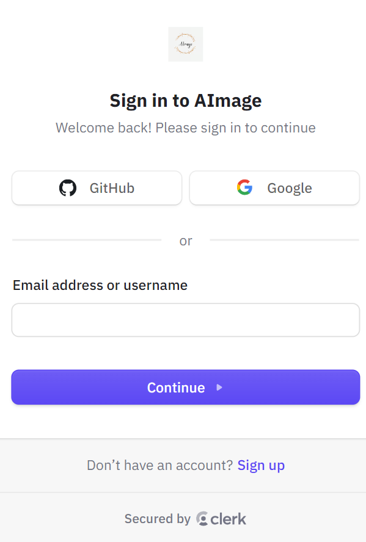

# Full Stack AI Software as a Service Platform

This repository contains the codebase for a Full Stack AI SaaS Platform built with [Next.js](https://nextjs.org/) bootstrapped with [`create-next-app`](https://github.com/vercel/next.js/tree/canary/packages/create-next-app).





## Features

- **Image Recolour**: Recolour images based on user input.
- **Background Removal**: Automatically remove backgrounds from images.
- **Image Generation from Text**: Allows users to generate images based on text input using AI.
- **Removing Imperfections**: Remove imperfections from images using AI.
- **Enhanced Dimensions**: Enhance the dimensions of images.
- **Removal of Objects**: Remove unwanted objects from images.
- **Stripe**: Handles subscription and payment processing.
- **ShadCN Components**: Offers pre-built UI components for a consistent and modern design.
- **Download Images**: Users can download processed images.
- **Advanced Search Functionality**: Search through content with advanced filtering options.
- **Pagination of Pages**: Paginate content for better navigation and user experience.

## Tech Stack

- **Framework**: Next.js 14
- **Language**: TypeScript
- **Styling**: Tailwind CSS
- **Authentication**: Clerk
- **Database**: MongoDB
- **Payments**: Stripe
- **UI Components**: ShadCN


## Setup

### Prerequisites

Ensure you have the following installed:

- Node.js
- npm or yarn
- MongoDB

### Installation

1. Clone the repository:

   ```bash
   git clone https://github.com/your-username/fullstack-ai-saas-platform.git
   cd fullstack-ai-saas-platform

2. Install dependencies:

   ```bash
   npm install

3. Set up environment variables:
   
   Create a .env.local file in the root directory and add the following:
    
   - NEXT_PUBLIC_CLERK_PUBLISHABLE_KEY
   - CLERK_SECRET_KEY
   - WEBHOOK_SECRET
   - MONGODB_URL
   - NEXT_PUBLIC_CLOUDINARY_CLOUD_NAME
   - CLOUDINARY_API_KEY
   - CLOUDINARY_API_SECRET
   - OPENAI_API_KEY
   - NEXT_PUBLIC_STRIPE_PUBLISHABLE_KEY
   - STRIPE_SECRET_KEY
   - STRIPE_WEBHOOK_SECRET
   - NEXT_PUBLIC_SERVER_URL


## Running the Application

1. Run the development server:

```bash
npm run dev
# or
yarn dev
# or
pnpm dev
# or
bun dev
```

2. Open [http://localhost:3000](http://localhost:3000) with your browser to see the result.


## Learn More

To learn more about Next.js, take a look at the following resources:

- [Next.js Documentation](https://nextjs.org/docs) - learn about Next.js features and API.
- [Learn Next.js](https://nextjs.org/learn) - an interactive Next.js tutorial.

You can check out [the Next.js GitHub repository](https://github.com/vercel/next.js/) - your feedback and contributions are welcome!

## Deploy on Vercel

The easiest way to deploy your Next.js app is to use the [Vercel Platform](https://vercel.com/new?utm_medium=default-template&filter=next.js&utm_source=create-next-app&utm_campaign=create-next-app-readme) from the creators of Next.js.

Check out our [Next.js deployment documentation](https://nextjs.org/docs/deployment) for more details.
